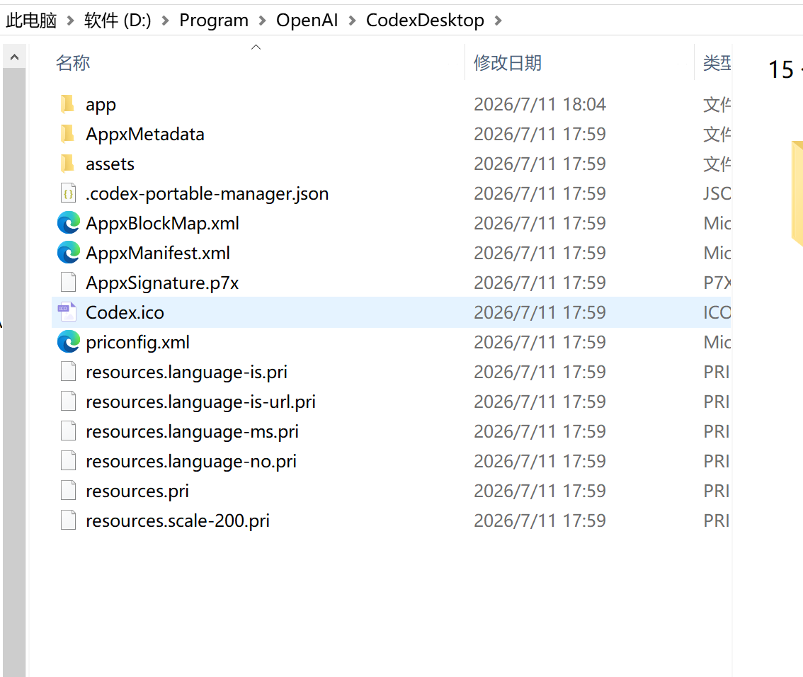
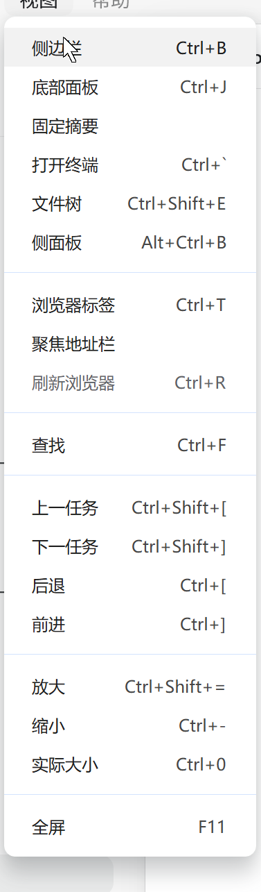
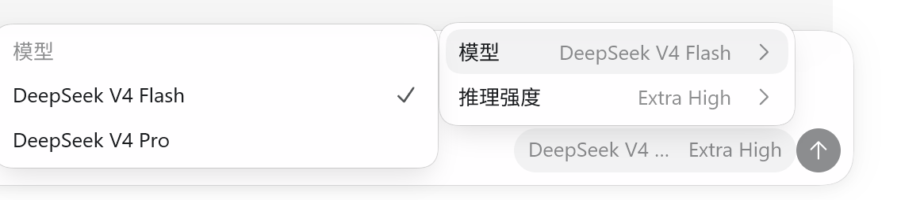
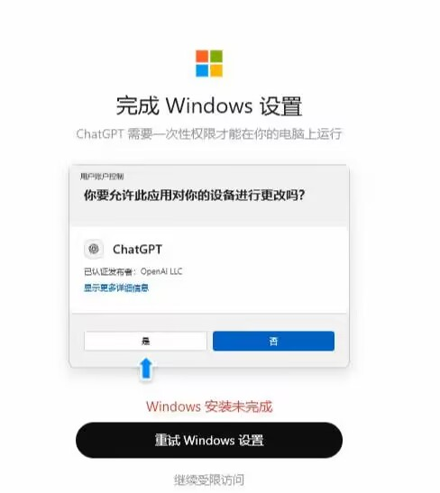

# Codex Portable Manager

面向 Windows 的开源 Codex 便携版管理器。它从微软官方分发服务获取并验证 MSIX，可将 Codex 部署到 D 盘、E 盘或其他普通目录，并负责后续更新、修复、回滚和卸载。

**[下载最新版本](https://github.com/tyhq/CodexPortableManager/releases/latest)** · **[提交问题](https://github.com/tyhq/CodexPortableManager/issues)**

> 本项目不是 OpenAI 官方工具。管理器创建的是基于官方 MSIX 的自定义 **unpackaged Win32** 便携版，不具备 Microsoft Store/MSIX 包身份；单独下载的官方 MSIX 仍由 Windows 管理。

## 适用场景

- Microsoft Store 无法打开、搜索或下载 Codex。
- 不希望把 Codex 安装到 C 盘，想自行选择本地目录。
- 希望集中完成便携版更新、修复、回滚、卸载和快捷方式维护。
- 只需要获取经过验证的微软官方 MSIX，再交给 Windows 安装。

## 两种使用方式

| 方式 | 结果 |
| --- | --- |
| 创建便携版 | 将官方程序文件部署到自定义普通目录，由本管理器维护，可使用可选兼容功能。 |
| 下载官方 MSIX | 只保存并验证官方安装包，由用户交给 Windows 应用安装程序；不会解包，也不会应用便携版兼容功能。 |

## 下载与使用

1. 从 [GitHub Releases](https://github.com/tyhq/CodexPortableManager/releases) 下载正式 EXE。
2. 将 EXE 放在具有写权限的普通目录中直接运行。管理器本身无需安装。
3. 创建便携版时，点击“选择位置”设置存放位置，再选择“创建 / 更新 / 修复”。如果所选位置非空且不是现有安装，管理器会使用独立的 `Codex` 子目录，并在界面显示最终目标路径。
4. 只需官方安装包时，选择“下载官方桌面版 MSIX”，下载完成后自行决定是否安装。
5. 兼容开关只有在点击“单独应用到便携版”后才会修改当前便携安装；新安装默认全部关闭。

> 当前 EXE 尚未配置 Authenticode 代码签名，Windows 首次运行时可能显示“未知发布者”。请从本仓库 Release 下载，并使用 Release 页面或随附的 `SHA256SUMS.txt` 核对 SHA-256。

## 下载建议与问题反馈

- 下载微软官方 MSIX 时，建议先不使用代理，优先通过国内网络直接连接微软分发服务和 CDN。多数情况下直连速度更快、连接也更稳定；代理线路可能因绕路、拥塞或限速降低速度。只有直连确实无法访问时，再尝试启用代理或切换网络。
- 遇到使用问题或发现缺陷，可以在 [GitHub Issues](https://github.com/tyhq/CodexPortableManager/issues) 提交反馈，也可以加入 QQ 群 `1105711986` 交流。反馈时建议附上 Windows 版本、管理器版本、操作步骤和界面或日志中的错误信息；公开发送前请隐藏个人路径、账号等敏感内容。

## 主要功能

- 通过微软 Display Catalog、Windows Update 分发服务和微软 CDN 获取对应架构的官方 Codex MSIX。
- 校验文件大小、SHA-256、数字签名、Publisher、包身份、架构、Manifest 和 BlockMap。
- 支持文件级增量更新、HTTP Range 断点续传、断网自动暂停与恢复，以及实时速度和预计剩余时间。
- 使用原子目录切换和可恢复事务完成安装、更新、修复及缓存低版本回滚，并保留 `.previous` 快速回滚槽；更早的旧备份在提交后由独立后台进程回收，关闭管理器不会中断。
- 卸载时先移除活动目录，再由独立后台进程安全回收当前版和回滚版；关闭管理器不会中断已提交的清理，用户资料和管理器缓存会保留。
- 可创建桌面与开始菜单快捷方式，并维护 `codex://`、文件关联、App Paths 和通知标识。
- 可选补全中文菜单、显示已接入的外部模型、统一推理强度名称，并修正特定 Windows 沙箱账户识别问题。
- 不修改 `%USERPROFILE%\.codex`、`%APPDATA%` 和 `%LOCALAPPDATA%\OpenAI` 中的既有用户资料。

## 功能展示

### 普通目录部署

Codex 主体文件部署到用户选择的普通目录，并通过所有权标记识别受管安装。

<p align="center">
  
</p>

### 中文菜单补全

在简体中文环境补全顶部菜单和托盘菜单文字。

<p align="center">
  
</p>

### 模型显示与技术参数

显示已经接入 Codex 的外部模型，并将推理强度名称保持为官方英文。

<p align="center">
  
</p>

### Windows 沙箱账户兼容

在系统错误识别裸用户名时，为 Codex 进程补全当前账户的限定名称。

<p align="center">
  
</p>

## 数据与安全边界

- 管理器在 EXE 同级创建 `data`，保存配置、官方 MSIX 缓存和日志；不会注册开机自启。
- 界面中的 MSIX 包版本用于微软目录查询和更新比较，应用内部版本来自官方程序内容；两者由官方分别设置，编号可能不同。
- 便携版不具有 WindowsApps ACL、Microsoft Store 许可证、自动更新或真实 MSIX 包身份。
- 管理器不会修改或接管 `C:\Program Files\WindowsApps`，可选兼容功能只作用于经过验证的受管便携目录。
- 安装根必须位于本地普通目录；UNC、映射网络盘、junction、符号链接和其他重解析点不进入部署事务。
- 更新、回滚、卸载和兼容调整均验证安装所有权、安装 ID 与目录身份；中断后通过 journal 恢复，无法确认时保留现场并停止破坏性操作。
- 管理器不会主动收紧目标目录权限。普通目录保持可移动和可写，也不具备 WindowsApps 的系统级防篡改边界。

完整的功能保留、信任链和威胁模型见 [功能与安全审计](AUDIT.md)。

## 系统要求

- Windows 10 1607 或更高版本，以及 Windows 11。
- .NET Framework 4.6.2 或更高版本。
- x64 或 arm64；管理器会按当前系统选择对应官方包。
- 便携版目标必须位于本地磁盘的普通目录。

## 项目文档

| 文档 | 用途 |
| --- | --- |
| [架构说明](docs/ARCHITECTURE.md) | 当前模块边界、事务设计和扩展约束。 |
| [功能与安全审计](AUDIT.md) | 官方功能保留、程序包信任、文件系统安全和威胁模型。 |
| [开发与验证](docs/DEVELOPMENT.md) | 构建环境、输出目录、测试命令和发布检查。 |
| [第三方声明](THIRD_PARTY_NOTICES.md) | 内嵌依赖及其许可证。 |

## 开发

```powershell
pwsh.exe -NoProfile -File .\build.ps1 -Configuration Release
.\scripts\tests\Run-RegressionTests.ps1
```

更完整的开发环境和验证说明见 [开发与验证](docs/DEVELOPMENT.md)。

## 许可证

项目使用 [MIT License](LICENSE)。第三方组件的许可信息见 [THIRD_PARTY_NOTICES.md](THIRD_PARTY_NOTICES.md)。
